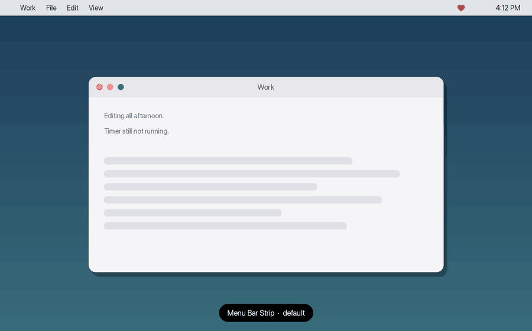

# Untracked

**A menu-bar nag for Toggl Track.** When no timer is running, Untracked flashes a
pulsing red overlay so you stop forgetting to start one. When a timer is running,
it gets out of the way.

[](https://github.com/emrikol/Untracked/releases)
[](LICENSE)
-lightgrey)



<sub>Mockup, not a screenshot — the heartbeat curve, colour and opacities are the
app's real values, but the pacing is compressed. The real beat is 0.7 s once
every 8 s.</sub>

The overlay is click-through, so it never blocks what you're doing. Detection is
local: Untracked reads the Toggl Track app's own database on your Mac. No API
token, no account, no network.

*Not affiliated with, endorsed by, or supported by Toggl. "Toggl" and "Toggl
Track" are trademarks of Toggl, used here only to identify the app this works
with.*

## Requirements

- macOS 15 or later, Apple silicon
- The [Toggl Track](https://toggl.com/track/) desktop app, signed in

## Install

Download the latest `Untracked-X.Y.Z.zip` from
[Releases](https://github.com/emrikol/Untracked/releases), unzip, and drag
`Untracked.app` to `/Applications`. Builds are signed with a Developer ID and
notarised by Apple, so they open without a Gatekeeper warning.

Launch it and you're done — it lives in the menu bar, with no Dock icon and no
setup. Updates install themselves via [Sparkle](https://sparkle-project.org),
verified against a signing key; **Check for Updates…** in the menu forces a check.

## Alert styles

| Style | Looks like |
|---|---|
| **Menu Bar Strip** *(default)* | A pulsing strip across the menu-bar area |
| **Screen Border** | A pulsing rim around every display, over full-screen apps too |
| **Both** | Both at once |

Switch from the menu, or set `alertStyle` in the config.

## Menu

- Live status — tracking, not tracking, paused, or why it's quiet ("Not tracking for 12m")
- **Open Toggl Track** — focuses the app, or the web timer if it isn't installed
- **Pause / Resume** — silence it without quitting
- **Snooze** — 10 / 30 / 60 minutes, for meetings
- **Alert Style**, **Flash When Tracking / Not Tracking**
- **Only Nag During Work Hours**, **Respect Focus / Do Not Disturb**
- **Edit Config…**, **Launch at Login**, **Check for Updates…**

## When it stays quiet

- **You're away** — screen locked, display asleep, or switched user.
- **Focus / Do Not Disturb is on**, if `respectDoNotDisturb` is set.
- **Outside your work hours**, if `workHoursEnabled` is set. It idles completely
  during these — no reads at all — and shows a 🌙 icon.
- **Paused or snoozed.**
- **Just after a timer stops** — `gracePeriodSeconds`, so ordinary task-switching
  doesn't set it off.
- **When it can't tell.** If Toggl's database is missing or unreadable, the state
  is *unknown* and it stays silent rather than nagging you wrongly.

It nags whenever you aren't tracking on this Mac, including when Toggl is closed
— closed means not tracking. It also can't see a timer you started only on your
phone. Pause or quit if that isn't what you want.

## Configuration

`~/.untracked.json`, created on first run. Edit it from the menu
(**Edit Config…**); changes apply instantly, no restart. Any key may be omitted.
It's strict JSON — no comments, no trailing commas — and a file that fails to
parse is ignored, keeping your previous settings.

```json
{
  "alertStyle": "menuBar",
  "flashWhenTracking": true,
  "flashWhenNotTracking": true,
  "trackingColor": "#34C759",
  "notTrackingColor": "#FF3B30",
  "beatPeriodSeconds": 8,
  "borderThickness": 10,
  "gracePeriodSeconds": 45,
  "respectDoNotDisturb": true,
  "workHoursEnabled": false,
  "workDays": "MTWRF",
  "workHours": "09:00-17:00"
}
```

| Key | Meaning |
|-----|---------|
| `alertStyle` | `"menuBar"`, `"border"`, or `"both"` |
| `flashWhenTracking` | Green heartbeat while a timer **is** running |
| `flashWhenNotTracking` | Red heartbeat while **not** tracking — the nag itself |
| `trackingColor`, `notTrackingColor` | `#RRGGBB` or `#RRGGBBAA` |
| `beatPeriodSeconds` | Seconds between heartbeats |
| `borderThickness` | Pixels, for the `border` style |
| `gracePeriodSeconds` | Delay after a timer stops before nagging |
| `respectDoNotDisturb` | Stay quiet during Focus / Do Not Disturb |
| `workHoursEnabled` | Only nag during the window below |
| `workDays` | `M` `T`ue `W` `R`hu `F` `S`at `U`n |
| `workHours` | Local time, `"HH:MM-HH:MM"` |

Turn off `flashWhenTracking` for nag-only; turn off both for a silent,
icon-only mode. Invalid colours fall back to red and green.

## How it works

Toggl Track keeps a Core Data SQLite store on disk:

```
~/Library/Group Containers/B227VTMZ94.group.com.toggl.daneel.extensions/production/DatabaseModel.sqlite
```

Untracked reads it directly — read-only, in place, no Full Disk Access needed —
and treats a non-deleted row with a NULL duration as a running timer. It watches
that directory with FSEvents, so it wakes only when Toggl writes, and a running
timer writes nothing. Idle cost is about 13 MB of memory, no measurable CPU, and
zero wake-ups.

> [!WARNING]
> That database is private and undocumented, as is the Focus state Untracked
> reads to stay quiet. A Toggl or macOS update could change either without
> notice. Both are designed to fail safe: if they break, Untracked goes quiet
> rather than nagging you incorrectly, and tells you once that it needs a fix.

macOS won't let one app recolour another app's window, which is why this paints
its own overlay instead of flashing Toggl's title bar.

## Build

Requires Xcode, plus:

```bash
brew install xcodegen swiftlint swiftformat shellcheck
```

All four are required — `build.sh` runs the static-analysis gate first and fails
without them.

```bash
./build.sh --install   # build, install to /Applications, launch
./build.sh             # build only, into ./build.noindex
```

Version numbers come from the newest `vX.Y.Z` git tag; untagged builds are marked
`-dev`. Run `./scripts/install-hooks.sh` once per clone to enable the commit
hooks. See [CLAUDE.md](CLAUDE.md) for architecture and design constraints.

## Support

**Provided as-is, with no support.**

- ✅ Use, modify, and redistribute it under the [GPL v2 or later](LICENSE).
- ❌ No support, bug fixes, or feature requests. Issues are disabled.
- ❌ Pull requests are accepted from collaborators only; others are auto-closed.
- 💡 **To change it, fork it** — the GPL explicitly grants you that right.

This is a personal project built around two undocumented files that can change
under it at any time, so supporting every combination of Toggl and macOS versions
isn't something one person can promise. If you redistribute a modified version,
please rename it to avoid confusion.

Security reporting: [SECURITY.md](SECURITY.md).

## License

[GNU General Public License v2.0 or later](LICENSE) — `GPL-2.0-or-later`.
